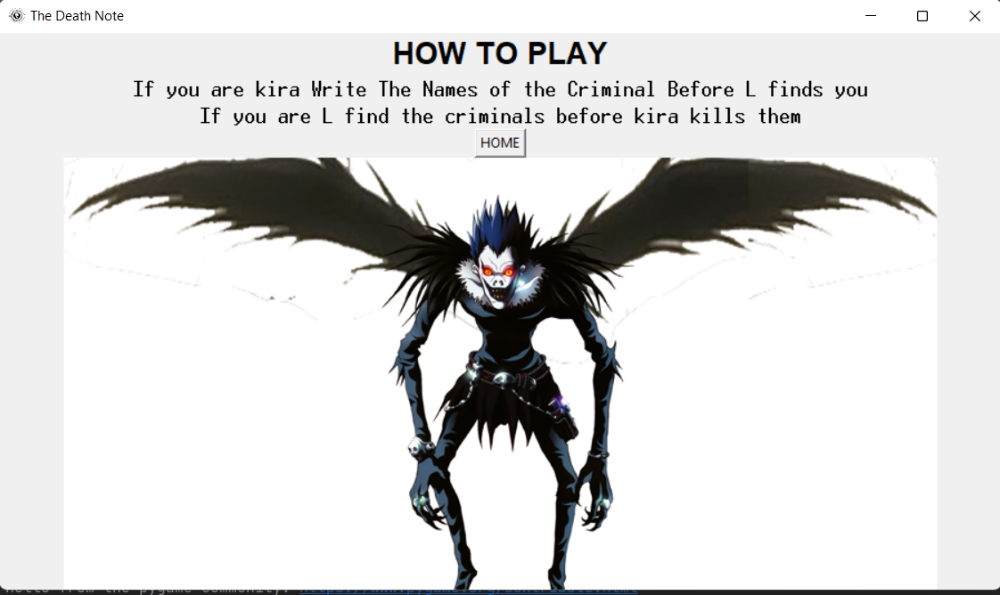
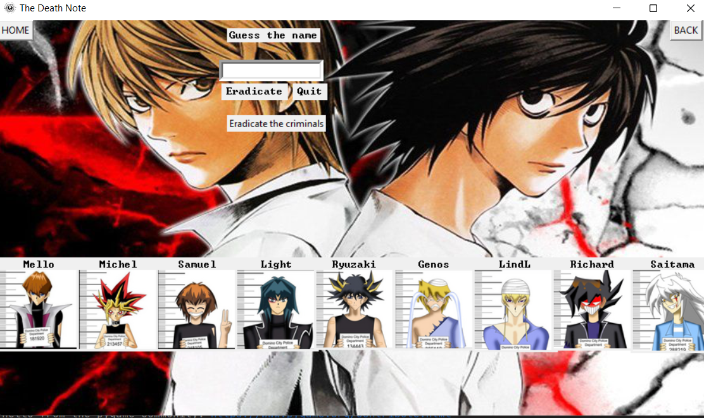
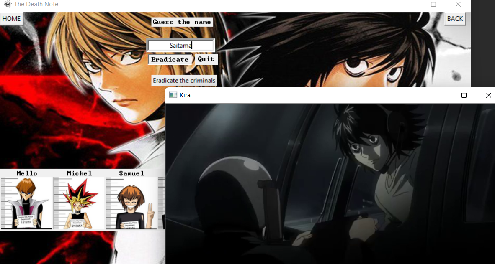

# Tkinter

Tkinter is the standard GUI(Graphical User Interface) library for Python. Python when combined with Tkinter provides a fast and easy way to create GUI applications. Tkinter provides a powerful object-oriented interface to the Tk GUI toolkit.

Creating a GUI application using Tkinter is an easy task. All you need to do is perform the following steps :−

  1. Import the Tkinter module.

  2. Create the GUI application main window.

  3. Add one or more of the above-mentioned widgets to the GUI application.

  4. Enter the main event loop to take action against each event triggered by the user. 

## Installation

You must have Python installed on your computer.
Tkinter is default toolkit so it will be on your computer once you installed python.

# Python_Game
The Death Note Anime based game

# Objective
To Create a GUI of a game based on The anime death note.
To create a user-friendly interface which can be accessed by everyone easily.
To understand the working of various modules which are being used to create this interface.

# Description of the project
The project includes the following:

 Start menu
 Instruction menu
 Background Music
 Game

# screeshots
 
#

#

#

#

#

